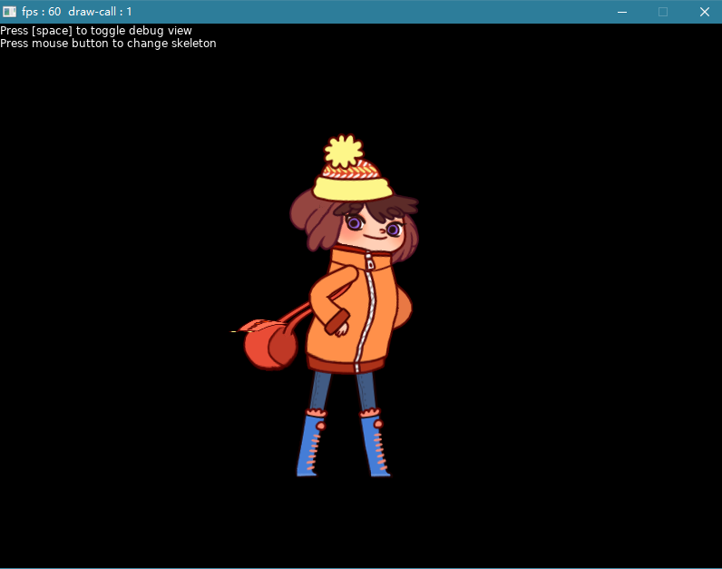

## Spine Love2DCS runtime library （Love2DCS 的 Spine库）
dependent（依赖项目） : https://github.com/EsotericSoftware/spine-runtimes/

## Folder Description
* `src` : main srouce code （主要源代码）
* `spine-lovecs` : visual studio 2017 project （VS2017工程项目文件）
* `example` : example code to use library （例子项目）
* `example_build` : example project output （例子的输出目录）
* `example_build/example_data` : example project data to use （例子项目使用的数据）

## useage
Pay attention to the clone sub-module （注意克隆子项目）

`git clone --recursive https://gitee.com/endlesstravel/spine-lovecs.git`

## Screenshot
